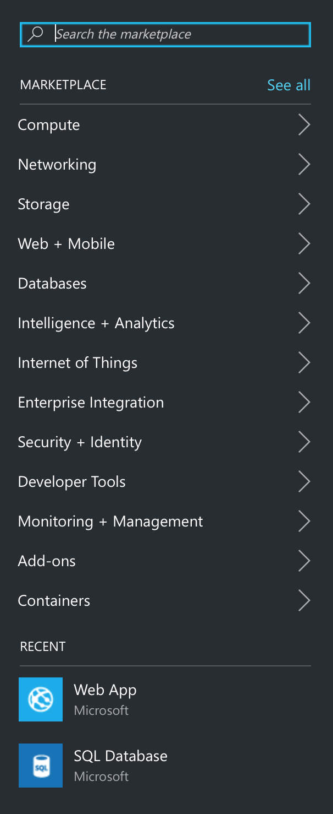
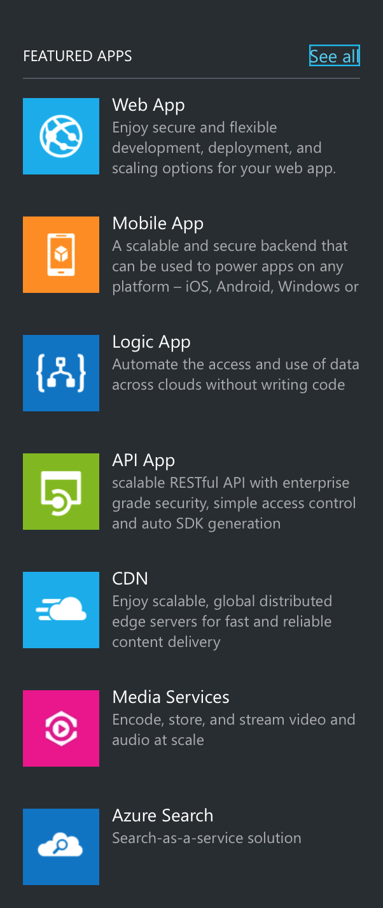
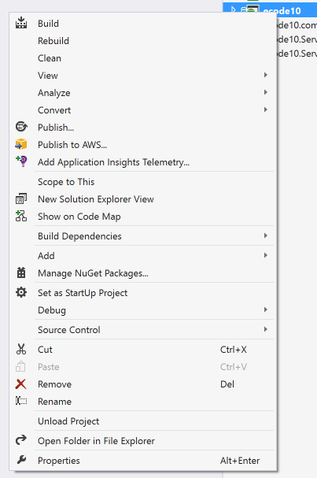
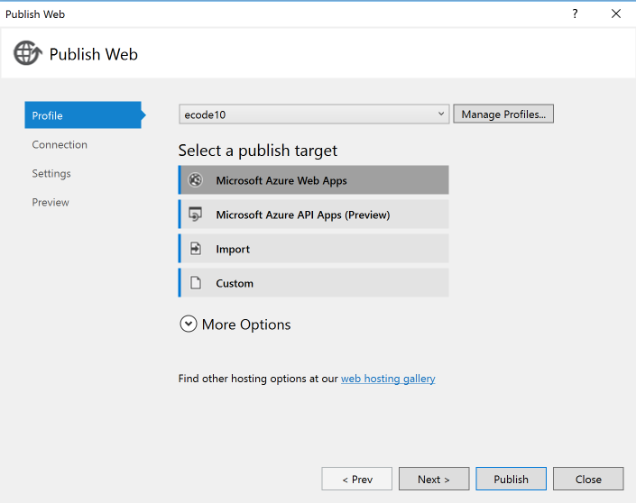
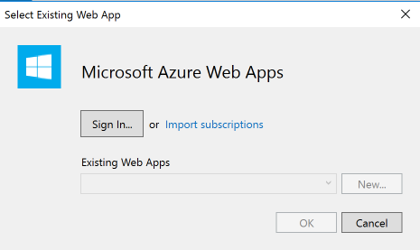
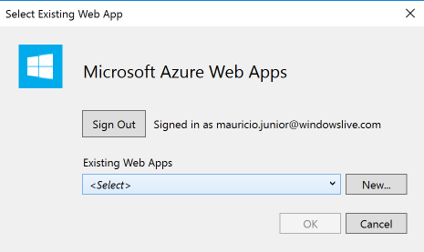
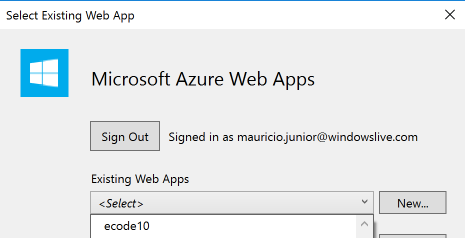
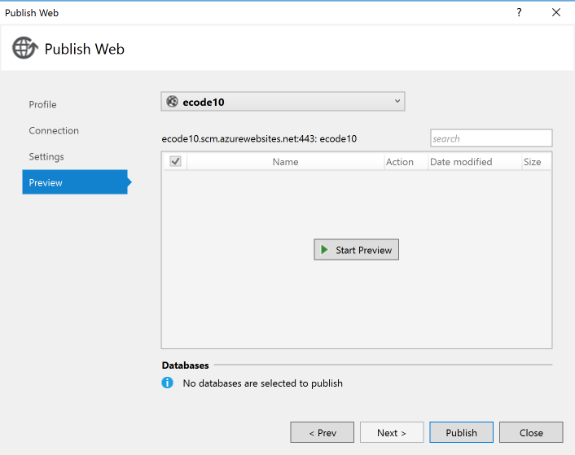

#Projeto .NET hospedado no Azure

##**Mauricio Junior**
**MVP, MCAD e MCP Microsoft**
Setembro, 2016

[Homepage](https://www.mauriciojunior.org)

Olá pessoal, meu nome é Mauricio Junior e hoje eu vou falar um pouco sobre como funciona a hospedagem .NET no servidor da Microsoft Azure. Muitos desenvolvedores não conhecem como funciona a hospedagem de site/sistema e não conhecem a plataforma chamada **Azure** como uma das maiores do mercado.

O Azure é uma plataforma que hospeda várias linguagens e plataformas, mesmo que a linguagem não Microsoft como Java, PHP e outros. Quando você desenvolve um site e quer que todos acessem ou utilizem o serviço, é necessário criar um endereço, colocar o código feito em um servidor e apontar o endereço para o servidor que hospedou. Para registrar um endereço *www* é necessário pagar um valor por ano.

Existem vários servidores de hospedagem e cada um tem uma ou várias tecnologias específicas. É necessário verificar se a tecnologia de hospedagem do servidor é a mesma desenvolvida por você.

O servidor também pode hospedar o banco de dados como: MySQL, SQL Server, Oracle ou outros. Não pense que, criar um servidor na sua casa será simples, não é tão fácil assim como você imagina. Envolve IP fixo ou instalar um programa "no-ip" mas isso é coisa de amador. Para ser profissional, utilize servidores e empresas profissionais e sérias para te ajudar a levantar seu negócio. Banco de dados hoje é um bem muito precioso, principalmente se existe dados relevantes; lembre-se que grandes empresas compram outras pelos dados, pela organização, pela ideia e pelo serviço. 

#Azure

O serviço **Azure** te entrega um endereço *www* sem precisar pagar pelo registro. Ele te entrega um endereço padrão da plataforma mas se quiser, você pode registrar o seu específico e apontar para o servidor **Azure** de forma simples e tranquila. Qualquer pessoa que entende um pouco de computador consegue fazer esse registro no órgão responsável e depois apontar para o servidor de hospedagem.

A ferramenta entrega pra você vários serviços e uma segurança inimagináveis. Eu mesmo já hospedei em lugares que não tinha segurança alguma e acabei me dando mal porque sequer tinha backup dos dados. Um dia o servidor desapareceu e todos os arquivos, banco de dado, e mesmo ligando para a empresa nada poderia ser feito, isto é, perdi tudo que tinha da noite para o dia. Você não precisa passar pelo menos sufoco que passei.

#Criando site

Um dos serviços da plataforma é a criação de site. Acesse o endereço [azure.com](http://www.azure.com) e depois de logar com usuário e senha, acesse o menu lateral esquerdo para criar. A figura 1 mostra o botão de *New* para criar um novo serviço.

Figura 1 - Criando novo serviço.

Depois de clicar no botão, outras opções serão mostradas na tela, como na figura 2. Como são muitos serviços, vou falar apenas do Web + Mobile. Escolha a opção Web + Mobile e vamos para o próximo passo. Figura 2.

Figura 2 - Opções e serviços.

A primeira opção é a Web App e é essa que precisamos criar o web site dentro da plataforma. Note que existem outras como a Mobile App que cria um aplicativo mobile para você e em várias plataformas de forma automática como: iOS, Android e Windows Phone. Este é um assunto que vou falar depois com você. Veja a figura 3.

Figura 3 - Web App

Depis que você escolhe o Web App para criar, outra tela aparece para criar um endereço com extensão **.azurewebsites.net**. Isso é genial porque neste primeiro momento, você não precisa gastar dinheiro para comprar e registrar um domínio .com, .com.br, .org, .tv e vários outros por ai. Lembro que os domínios podem chegar até mais de $5 mil dólares dependendo do nome.

A figura 4 pede o nome do app para gerar um endereço local, o segundo campo mostra e pede para você escolher qual a sua assinatura na ferramenta, depois indique se é um novo ou existente recurso. Alé disso você pode indicar que o seu site seja hospedado em um lugar do mundo que a empresa possui servidores. Incrível isso, mesmo do Brasil, o site pode ser hospedado nos Estados Unidos, Europa, Ásia e outros. Veja a figura 4.

Figura 4 - Web App

Depois disso, basta pegar o **profile** do projeto para fazer o primeiro **deploy** no servidor. 

#Deploy no servidor

O Visual Studio da Microsoft possibilita a publicação do software de maneira simples e correta, por exemplo: você nunca deve colocar o código fonte aberto no serivdor de hospedagem, é muito melhor colocar código já compilado. Isso evita qualquer tipo de invasão ou roubo de código.

Usando tecnologia .NET, todo o código fonte vira arquivo .dll. Os únicos arquivos que vão abertos são as páginas .ASPX. Para publicar basta clicar com o botão direito em cima do projeto *Web* e escolha a opção *Publish...* Note que no menu de opções existe um outro *Publish to AWS*, isso quer dizer que até a Amazon criou um *plugin* para instalar e publicar de maneira correta dentro do servidor deles. 

Servidores que não fazem isso, geralmente você precisa de um *software* cliente de FTP para publicação dos arquivos lá no servidor. Nestes dois casos, "Azure e Amazon", a própria ferramenta Visual Studio publica sem precisar do cliente FTP. Veja a figura 5.

Figura 5 - Publicando

A próxima tela que aparece, existe a opção de logar no **Microsoft Azure Web Apps** com usuário e senha para escolher no servidor o profile correto. Veja a figura 6.

Figura 6 - Tela de publicação

Depois de clicar no botão Microsoft, vai aparecer outra tela para logar no servidor com usuário e senha. Veja a figura 7.

Figura 7 - Logando

Depois de logar no sistema, vai aparece preenchido todos os Web Apps existentes no servidor de hospedagem. Basta escolher qual e clicar no botão Ok. Veja a figura 8.

Figura 8 - Escolhendo as opções de Web Apps

A figura 9 mostra a lista de aplicativos no servidor.

Figura 9 - Listando os Web Apps

Para finalizar, basta clicar no botão **Publish**. O sistema vai analisar todo o software, compilar e montar um pacote para publicação no servidor através de FTP ou do padrão de protocolo do servidor. Depois de publicar, o site abre automaticamente para o desenvolvedor testar o site.

Figura 9 - Listando os Web Apps

Note que tudo o que foi falado aqui é bem simples e rápido, isto é, ajuda muito o desenvolvedor no momento da pulicação do site ou sistema no servidor. É impressionante o tanto que a Microsoft montou uma plataforma boa e efeciente, se preocupando com o bem estar do desenvolvedor que por muitas vezes perde muito tempo para publicar.

Espero que tenha gostado e qualquer dúvida pode entrar em contato comigo pelo site [www.mauriciojunior.org](https://www.mauriciojunior.org).
