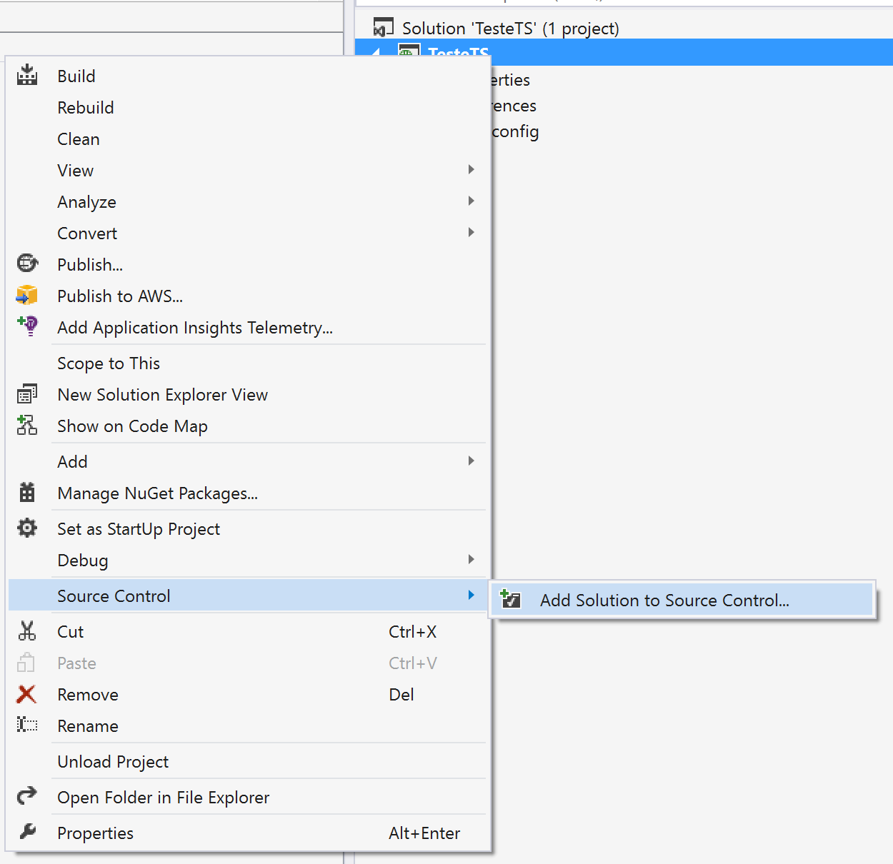
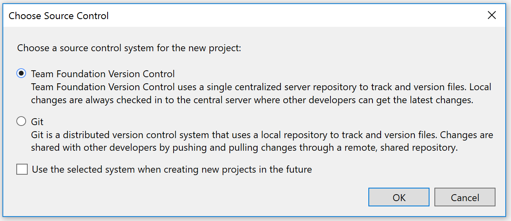
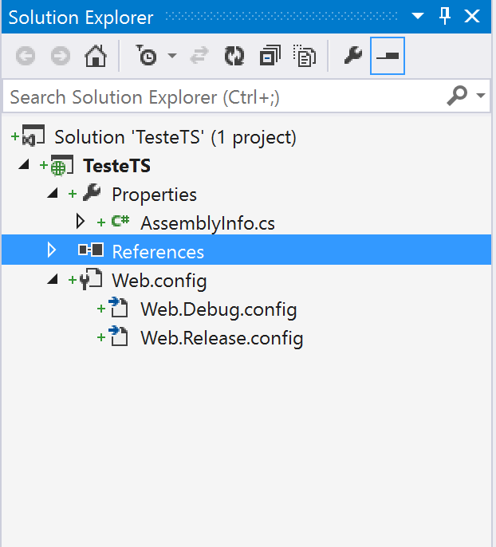
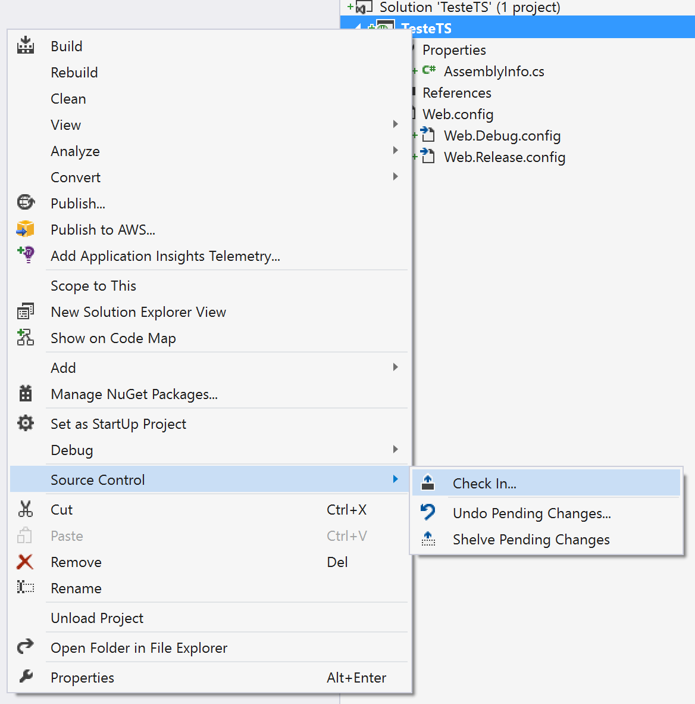
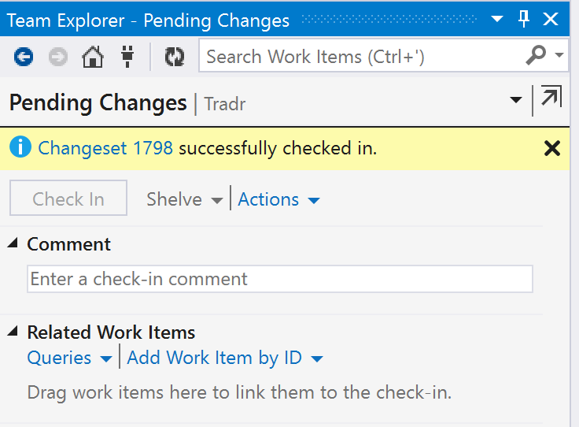
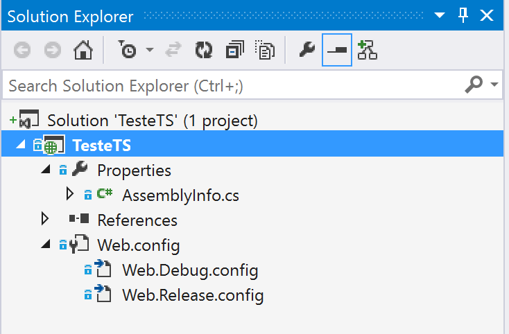
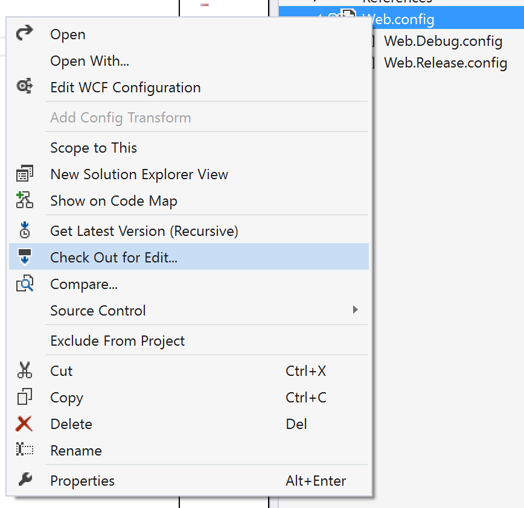
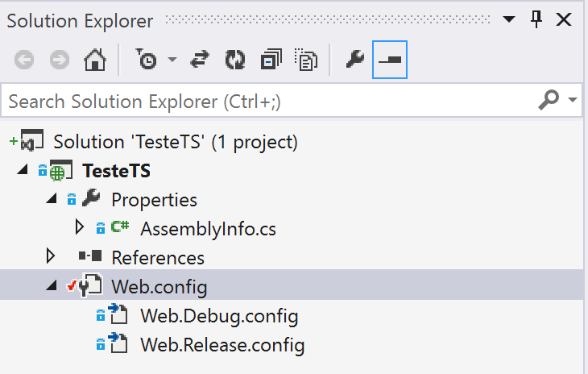

#Team Services: como controle de código fonte

##**Mauricio Junior**
**MVP, MCAD e MCP Microsoft**
Outubro, 2016

[Homepage](https://www.mauriciojunior.org)

Olá pessoal, meu nome é Mauricio Junior e eu vou falar um pouco sobre o versionador de código integrado ao Visual Studio da Microsoft, além de comentar das possibilidades de integração existentes na ferramenta.

**Utilizado no artigo**

1. Visual Studio 
2. Linguagem C#
3. Team Services

Quais são as preocupações que abordam os desenvolvedores de código? Desenvolver um ótimo código, de fácil manutenção, comentado, integrado, não perder código no decorrer do tempo e versionar para um bom build. Concorda comigo? E hoje existem vários sistemas que versionam código como: [Team Services](http://tfs.visualstudio.com), [GitHub](http://github.com), [BitBucket](http://bitbucket.org), [GitLab](http://www.gitlab.com) e outros.

**O que é versionar código?**

É manter o código sempre ativo, numerado e guardado; mesmo depois de uma alteração pequena ou grande do software. Classifico como software, mas pode ser um aplicativo, web site, sistema desktop ou sistema para qualquer dispositivo que vier a existem daqui pra frente. Se você souber versionar seu código, nunca irá perder o que desenvolveu. 

Mesmo depois de alterado, você pode pegar o que foi feito anteriormente. Isso mesmo, o código nunca é perdido e os números versionados podem ser publicados nos locais que desejar. O código compilado pode ser integrado a um servidor que publica, como por exemplo o [Azure](http://www.azure.com) criado pela Microsoft.

**Team Services**

O serviço da Microsoft vai além de controlar o código fonte, ele pode servir como um sistema que passa a tarefa para desenvolvedores, gerencia tempo e gerenciamento de builds, pra você vê. Os outros serviços citados anteriormente não possuem isso tudo, mas estão sendo modificados para ter todo tipo de informação gerencial e de build.

A figura 1 mostra a tela responsável pelo gerenciamento de código já integrado ao Visual Studio. Você pode acessar o portal pela web, as tarefas pra você e ver a sala da equipe. Você pode também acessar o Source Control Explorer que mantém as versões do código fonte escrito por você ou qualquer outra da equipe. 

O Team Services possui vários serviços e um deles é o versionador. Veja a figura 1.

Figura 1 - Team Explorer

Clique no botão Source Control Explorer para verificar todos os códigos fontes que tenho armazenado no sistema da Microsoft. É dividio em pastas e dentro das pastas temos os arquivos, *frameworks* e mais versionado como imagens. Para navegar entre as pastas e dados, é necessário clicar nas setas ao lado direito da tela. Se uma pasta for selecionada, todas as outras pastas e arquivos serão mostrados ao lado direito. O *Workspace* é marcado sempre pelo nome do computador ao lado direito na tela. O item *Local Path* mostra onde está localizado o código em seu computador pessoal. No caso de não estar em seu computador, o item estará em branco e para qualquer alteração é necessário fazer download do código primeiro. Veja a figura 2.

Figura 2 - Acessando Source Control Explorer

Depois de criar uma solução utilizando a ferramenta, como eu posso adicionar tudo ao versionador? Basta clicar com o botão direito em cima do projeto, escolha a opção Source Control e depois a sub-opção chamada *Add Solution to Source Control*... Veja a figura 3.

Figura 3 - Adicionando o código fonte ao versionador

Depois de clicar para adicionar, outra tela aparece mostrando pra você escolher duas opções. O Team Foundation Version Control e o Git. Como muitos sabem, o Git é um padrão que todos estão utilizando, mas lembre-se que existe a versão paga e grátis. Empresas estão utilizando a versão paga, a maioria das empresas pelo menos. A versão paga, ninguém tem acesso ao código fonte. A versão grátis, todos tem acesso e todos podem ver o código desenvolvido, fazer download, copiar e tal. A vantagem do *Team Foundation Version Control* é que é grátis e ao mesmo tempo privado para a equipe. Ninguém consegue ver o que foi desenvolvido se for acessado o endereço como no Git. Escolhi o que veio selecionado e clique no botão Ok. Veja a figura 4.

Figura 4 - Adicionando o código fonte ao versionador

Uma nova tela aparece e todas as pastas existentes em seu endereço dado pela Microsoft no momento de criar a conta. Escolha uma, verifique o nome e clique no botão Ok. Para criar uma nova pasta, é necessário acessar o endereço da Web. Vamos imaginar que já temos pastas principais criadas e basta escolher uma e clicar no botão. Veja a figura 5.

Figura 5 - Escolhendo a pasta para adicionar

Com todos os passos anteriores, você apenas adicionou todos os arquivos ao versionador, mas como não foi dado *checkin*, os arquivos estão com o sinal de + (mais) antes do nome. Preste bem atenção nestes sinais antes dos nomes dos arquivos. Veja a figura 6.
 

Figura 6 - Sinal antes do nome do arquivo

Para fazer o *checkin* dos arquivos, clique com o botão direito em cima do projeto, escolha o menu *Source Control* e depois *Check. In...* Todos os arquivos serão adicionados ao servidor. Veja a figura 7.

Figura 7 - Fazendo *Check In...*

Antes de adicionar efetivamente ao servidor, é necessário escrever algum comentário na subida do código. Note que os arquivos estão com o *status* *[add]* depois do nome. Existe também o item de trabalho na lista, se houver algum item de trabalho. Se algum arquivo for excluído, o *status* será mostrado. Veja a figura 8.

Figura 8 - Comentando e adicionando

Depois de adicionar o comentário, clique no botão *Check In* e o *status* será mostrado conforme a imagem *Changeset 1798 successfully checked in*. Até então, os arquivos não estavam versionados no servidor e ao clicar no botão tudo foi enviado. Veja a imagem 9.

Figura 9 - CheckIn

Com os arquivos adicionados, um cadeado é mostrado antes do nome dos arquivos conforme mostrado na figura 10. 

Figura 10 - Cadeado

Você tem duas opções: clicar *Check Out for Edit*, ou seja, editar o arquivo e a segunda é abrir o arquivo e alterar. Lembre-se que o arquivo só será enviado novamente ao servidor se realmente tiver sido alterado, mesmo que seja com um simples espaço. 

Figura 11 - Fazendo *Check Out*

Para fazer *check out* o ícone antes do arquivo aparece como um *check* conforme mostrado na imagem 12. 

Figura 12 - Mostrando o *Check Out*

Este é um dos serviços do Team Services disponível gratuitamente no site da Microsoft e oferecido de forma integrada pela ferramenta de desenvolvimento Visual Studio. Espero que tenha gostado e tenha aprendido. Já utilizei todos os versionadores citados e este nunca saiu do ar comigo como os outros. Qualquer dúvida, pode entrar em contato comigo pelo site [www.mauriciojunior.org](https://www.mauriciojunior.org)
