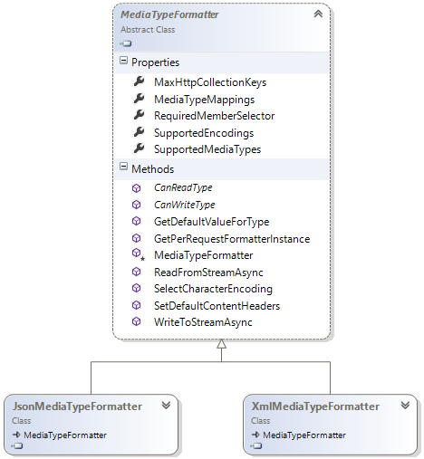
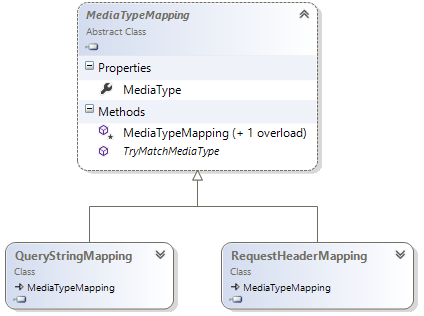

# ASP.NET Web API - Formatadores


##**Israel Aece**

Um dos maiores benefícios ao se utilizar uma biblioteca ou um framework é a facilidade que ele nos dá para tornar a construção de algo mais simplificada, abstraindo alguns pontos complexos, permitindo com que o utilizador foque diretamente (e na maioria das vezes) na resolução de problemas voltados ao negócio, sem gastar muito tempo com questões inerentes à infraestrutura e/ou similares.

A finalidade do ASP.NET Web API é justamente facilitar a construção de APIs para expor via HTTP. Apesar de uma das principais características de uma API é abraçar o HTTP, a abstração acaba sendo útil em alguns casos, mas em outros não. A Microsoft se preocupou com isso, abstraindo alguns aspectos para tornar a construção e o consumo destas APIs mais fáceis, sem perder o poder de customização e acesso aos recursos expostos pelo protocolo HTTP.

Como vimos nos capítulos anteriores, possuímos os objetos HttpRequestMessage e HttpResponseMessage, quais podemos definir na assinatura das ações do controller e, consequentemente, ter o acesso total à todos os recursos do HTTP. Apesar de que em alguns casos isso possa ser útil, na sua grande maioria, temos que lidar com alguns pontos que a abstração poderia ajudar a nos manter mais focados no negócio do que na infraestrutura.

Um grande exemplo disso tudo é o conteúdo (payload) da mensagem. Em geral, o corpo da mensagem representa um objeto que deve ser materializado e entregue ao método que tratará a requisição. A postagem que o cliente faz ao serviço pode ser realizada em diferentes formatos, como por exemplo: Json, Xml, Csv, formulário, etc.

Como já foi dito anteriormente, o uso de um framework tem a finalidade de abstrair certos pontos para tornar a programação mais simples. Aqui temos um grande exemplo disso. O ASP.NET Web API fornece alguns recursos intrinsícos que torna a serialização e deserialização transparente ao ponto de vista do serviço/método. Esses recursos são o Model Binding e os Formatadores.

As aplicações geralmente trabalham com objetos que descrevem suas características, onde estes objetos são manipulados o tempo todo, já que na grande maioria dos casos, ela acaba também sendo persistido no banco de dados, apresentado na tela, etc. Como esses objetos são parte do core da aplicação, é muito comum criarmos formulários que apresente a instância no mesmo na tela (HTML), para que o usuário seja capaz de editá-lo.

Ao submeter o formulário para o servidor, todas as informações (querystrings, body, URI, etc.) chegam através de um dicionário, onde cada valor está associado à uma chave. Ao invés de manualmente construirmos a instância da classe baseada no corpo da requisição, o ASP.NET MVC já fez esse árduo trabalho para nós, e o responsável por isso são os model binders. Baseando-se na action para qual estamos postando a requisição, ele captura o tipo do objeto que precisa ser criado, mapeando o dicionário para cada uma de suas propriedades.

Olhando mais de perto, os model binders são os responsáveis por construir os objetos, baseando-se em um dicionário que contém as informações que foram extraídas da requisição através de Value Providers. O ASP.NET Web API possui algumas implementações embutidas, mas nada impede de criarmos alguma customização tanto para o value provider (se quisermos customizar como extrair as informações da requisição), bem com o model binder (se quisermos customizar como construir a instância do objeto).

Ao efetuar uma requisição para algum recurso sobre o protocolo HTTP, o servidor identifica o mesmo, faz o processamento, gera o resultado e, finalmente, devolve o resultado para o cliente que fez a solicitação. Por mais que isso não fica explícito, o conteúdo que trafega do cliente para o servidor (requisição) e do servidor para o cliente (resposta), sempre possui um formato específico.

Em grande parte de todos os recursos fornecidos através do protocolo HTTP, uma das necessidades é justamente definir o formato deste conteúdo, que por sua vez, direciona a interpretação pelo navegador, por uma outra aplicação ou até mesmo de uma biblioteca, permitindo efetuar o parser do resultado e, consequentemente, materializar o mesmo em algo "palpável"/visível.

Os formatos são representados por uma simples string, onde você tem uma primeira parte para descrever qual o tipo de conteúdo, e depois o seu formato. Por exemplo, ao invocar uma página onde o retorno é um conteúdo HTML, o formato será definido como text/html; ao solicitar uma imagem, o seu formato será definido como image/jpeg. Uma lista contendo todos os formatos de conteúdos disponíveis na internet, é gerenciada e mantida por entidade chamada IANA.

Como o ASP.NET Web API tem uma forte afinidade com as características do HTTP, ele permite receber ou gerar conteúdos em formatos popularmente conhecidos pelo mercado, e vamos perceber que os serviços que criamos utilizando essa API nada sabem sobre o formato em que ele chegou ou o formato em que ele será devolvido para o cliente. O ASP.NET Web API unifica o processo de serialização e deserialização dos modelos através de formatadores, que baseado em um media type específico, executa o trabalho para materializar a requisição em um objeto de negócio (modelo).

Apesar dos principais formatadores já estarem vinculados à execução, precisamos analisar a estrutura da classe que representa um media type para realizar futuras customizações. Para isso, a Microsoft criou uma classe abstrata chamada de MediaTypeFormatter, e já existem algumas implementações definidas dentro da API, como por exemplo, as classes XmlMediaTypeFormatter e JsonMediaTypeFormatter.

Uma pergunta pertinente que aparece é como o ASP.NET Web API escolhe qual dos formatadores utilizar. A escolha se baseia no formato solicitado pelo cliente. O formato pode ser incluído como um item na requisição, através do header Accept ou do Content-Type. O ASP.NET Web API escolhe o formatador de acordo com o valor que ele encontra em um desses headers, e caso o formato definido não for encontrado, o padrão é sempre devolver o conteúdo em formato Json.



Figura 16 - Hierarquia das classes de formatadores.

Ao contrário do que fazemos no cliente, o serviço não trabalha diretamente com estes formatadores, pois isso fica sob responsabilidade de objetos internos, que durante a execução fazem todo o trabalho para encontrar para ler ou escrever o conteúdo no formato requisitado. O responsável por fazer esta análise e encontrar o formatador adequado é a classe DefaultContentNegotiator através do método Negotiate (fornecido pela interface IContentNegotiator).

Para percebermos a mágica que o ASP.NET Web API faz, vamos utilizar o Fiddler para criar e monitorar as requisições. No primeiro exemplo, vamos invocar um método que dado o nome do artista, ele retorna um objeto complexo contendo as características deste artista. Abaixo temos a primeira requisição sendo executada e seu respectivo retorno.

```
[Requisição]

GET http://localhost:43139/api/artistas?nome=MaxPezzali HTTP/1.1

User-Agent: Fiddler

Host: localhost:43139
```

```
[Resposta]

HTTP/1.1 200 OK

Content-Type: application/json; charset=utf-8

Content-Length: 75


{"Id":5,"Nome":"MaxPezzali","AnoDeNascimento":1967,"QuantidadeDeAlbuns":20}
```

Note que não mencionamos nenhum header extra na requisição, e o objeto artista foi devolvido serializado em Json. Nós podemos requisitar que o conteúdo seja devolvido em um determinado padrão. Para isso, recorreremos ao atributo Accept para informar ao serviço que o aceito o retorno em um determinado formato. Os logs abaixo exibem a requisição e a resposta para o formato Xml:

```
[Requisição]

GET http://localhost:43139/api/artistas?nome=MaxPezzali HTTP/1.1

Host: localhost:43139

Accept: application/xml
```

```
[Resposta]

HTTP/1.1 200 OK

Content-Type: application/xml; charset=utf-8

Content-Length: 252

<Artista xmlns:i="http://www.w3.org/2001/XMLSchema-instance" xmlns="http://schemas.datacontract.org/2004/07/MusicStore.Models"><AnoDeNascimento>1967</AnoDeNascimento><Id>0</Id><Nome>MaxPezzali</Nome><QuantidadeDeAlbuns>20</QuantidadeDeAlbuns></Artista>
```

Percebemos que a o resultado é bem maior quando o resultado é devolvido em Xml, pelo fato da sua estrutura ser bem mais verbosa que o Json. Além disso, ainda há quem defenda que se o serviço não suportar o formato requisitado pelo cliente, ele não deveria acatar a requisição. Para termos este comportamento no ASP.NET Web API, nós temos que criar código customizado para conseguir rejeitar a requisição.

Como vimos acima, por padrão, o ASP.NET Web API faz a busca do formato na coleção de headers da requisição, mas isso pode ser customizado. Podemos instruir o ASP.NET Web API localizar o formato na querystring, e utilizaremos o objeto de configuração para realizar esse ajuste.



Figura 17 - Hierarquia das classes referente ao mapeamento de media-types.

Existe uma classe chamada MediaTypeMapping, e como o nome sugere, ele traz a infraestrutura para extrair o media type de algum elemento da requisição. Como vemos no diagrama acima, temos as classes QueryStringMapping e RequestHeaderMapping, que buscam o media type dentro da coleção de querystrings e headers, respectivamente.

Note que no código abaixo inserimos o mapeador de querystring, indicando qual a chave onde será informado o formato, e se ele for encontrado, o media type será utilizado pelos componentes internos para gerar o resultado no formato que o cliente está solicitando em um local diferente do padrão.

```
C#

public class WebApiApplication : System.Web.HttpApplication
{
    protected void Application_Start()
    {
        WebApiConfig.Register(GlobalConfiguration.Configuration);

        this.ConfigMediaTypeMappings(GlobalConfiguration.Configuration);
    }

    private void ConfigMediaTypeMappings(HttpConfiguration config)
    {
        config.Formatters.JsonFormatter.MediaTypeMappings.Add(
            new QueryStringMapping("formato", "json", "application/json"));

        config.Formatters.JsonFormatter.MediaTypeMappings.Add(
            new QueryStringMapping("formato", "xml", "application/xml"));
    }
}
```

Com o código acima em funcionamento, a requisição pode ser realizada da seguinte forma:

http://localhost:43139/api/artistas?nome=MaxPezzali&formato=json

http://localhost:43139/api/artistas?nome=MaxPezzali&formato=xml

#Customização

Apesar do Xml e Json serem os principais formatos que temos atualmente, pode haver situações onde desejamos criar um formato próprio, para que esse possa gerar e/ou receber o conteúdo em um formato específico. Como já percebemos acima, se desejarmos fazer isso, temos que recorrer à implementação da classe abstrata MediaTypeFormatter, customizando basicamente dois métodos principais OnReadFromStream e OnWriteToStream. Vamos analisar cada um desses métodos abaixo:

* CanReadType: Dado um objeto do tipo Type, este método retorna um valor boleano (onde o padrão é True), indicando se aquele tipo é ou não entendido por aquele formatador. O tipo identifica os eventuais parâmetros que existem no método do serviço. Aqui podemos fazer validações, como por exemplo, identificar se o tipo é ou não serializável, se possui um determinado atributo, etc.

* ReadFromStreamAsync: Se o método acima retornar True, então este método é executado. Como parâmetro ele recebe o tipo do objeto (o mesmo que foi passado para o método acima), e um objeto do tipo Stream, que é fonte das informações (estado) do objeto a ser criado. Este método retorna um object, que corresponde à um objeto criado dinamicamente e configurado com os valores provenientes do Stream.

* CanWriteType: Dado um objeto do tipo Type, este método retorna um valor boleano (padrão é True), indicando se aquele tipo é ou não entendido pelo formatador. O tipo identifica o retorno do método do serviço. Aqui podemos fazer validações, como por exemplo, identificar se o tipo é ou não serializável, se possui um determinado atributo, etc.

* WriteToStreamAsync: Se o método acima retornar True, então este método é executado. Como parâmetro, ele recebe o tipo do objeto a ser serializado e um object que corresponde a instância do objeto a ser gravado. Ainda recebemos um Stream, que é o destino do objeto serializado.

Como um possível exemplo, podemos criar um formatador específico para o formato CSV, que é um padrão bem tradicional, onde cada valor é separado pelo caracter ";". Abaixo temos a classe CsvMediaTypeFormatter, que herda de MediaTypeFormatter. Note a definição do formato application/csv sendo adicionado à coleção de media types suportados por este formatador customizado, que está acessível através da propriedade SupportedMediaTypes.

```
C#
public class CsvMediaTypeFormatter : MediaTypeFormatter
{
    private const char SEPARATOR = ';';

    public CsvMediaTypeFormatter()
    {
        this.SupportedMediaTypes.Add(
            new MediaTypeHeaderValue("application/csv"));
    }

    //implementação
}
```

Como já era esperado, o que precisamos fazer a partir de agora é instalá-lo à execução. E para isso, recorremos novamente a classe de configuração do ASP.NET Web API, que através da propriedade Formatter (que é uma coleção), podemos incluir classes que herdam de MediaTypeFormatter. O que fazemos aqui é instanciar e adicionar a classe CsvMediaTypeFormatter:

```
Formatter

config.Formatters.Add(new CsvMediaTypeFormatter());
```

Com isso, ao receber ou retornar uma mensagem com o header Accept ou Content-Type definido como application/csv, a API já é capaz de interpretar e retornar objetos serializados neste formato.

#Veja também:

[ASP.NET Web API – HTTP, REST e o ASP.NET](https://msdn.microsoft.com/pt-br/library/dn369238.aspx): Para basear todas as funcionalidades expostas pela tecnologia, precisamos ter um conhecimento básico em relação ao que motivou tudo isso, contando um pouco da história e evolução, passando pela estrutura do protocolo HTTP e a relação que tudo isso tem com o ASP.NET.

[ASP.NET Web API – Estrutura da API](https://msdn.microsoft.com/pt-br/library/dn376302.aspx): Entenderemos aqui a template de projeto que o Visual Studio fornece para a construção das APIs, bem como sua estrutura e como ela se relaciona ao protocolo.

[ASP.NET Web API – Roteamento](https://msdn.microsoft.com/pt-br/library/dn376303.aspx): Como o próprio nome diz, o capítulo irá abordar a configuração necessária para que a requisição seja direcionada corretamente para o destino solicitado, preenchendo e validando os parâmetros que são por ele solicitado.

[ASP.NET Web API – Hosting](https://msdn.microsoft.com/pt-br/library/dn376304.aspx): Um capítulo de extrema relevância para a API. É o hosting que dá vida à API, disponibilizando para o consumo por parte dos clientes, e a sua escolha interfere diretamente em escalabilidade, distribuição e gerenciamento. Existem diversas formas de se expor as APIs, e aqui vamos abordar as principais delas.

[ASP.NET Web API – Consumo](https://msdn.microsoft.com/pt-br/library/dn376305.aspx): Como a proposta é ter uma API sendo consumido por qualquer cliente, podem haver os mais diversos meios (bibliotecas) de consumir estas APIs. Este capítulo tem a finalidade de exibir algumas opções que temos para este consumo, incluindo as opções que a Microsoft criou para que seja possível efetuar o consumo por aplicações .NET.

[ASP.NET Web API – Formatadores](https://msdn.microsoft.com/pt-br/library/dn376306.aspx): Os formatadores desempenham um papel importante na API. São eles os responsáveis por avaliar a requisição, extrair o seu conteúdo, e quando a resposta é devolvida ao cliente, ele entra em ação novamente para formatar o conteúdo no formato em que o cliente possa entender. Aqui vamos explorar os formatadores padrões que já estão embuitdos, bem como a criação de um novo.

[ASP.NET Web API – Segurança](https://msdn.microsoft.com/pt-br/library/dn376307.aspx): Como a grande maioria das aplicações, temos também que nos preocupar com a segurança das APIs. E quando falamos de aplicações distribuídas, além da autenticação e autorização, é necessário nos preocuparmos com a segurança das mensagens que são trocadas entre o cliente e o serviço. Este capítulo irá abordar algumas opções que temos disponíveis para tornar as APIs mais seguras.

[ASP.NET Web API – Testes e Tracing](https://msdn.microsoft.com/pt-br/library/dn376309.aspx): Para toda e qualquer aplicação, temos a necessidade de escrever testes para garantir que a mesma se comporte conforme o esperado. Isso não é diferentes com APIs Web. Aqui iremos abordar os recursos, incluindo a própria IDE, para a escrita, gerenciamento e execução dos testes.

[ASP.NET Web API – Estensibilidade e Arquitetura](https://msdn.microsoft.com/pt-br/library/dn376308.aspx): Mesmo que já tenhamos tudo o que precisamos para criar e consumir uma API no ASP.NET Web API, a customização de algum ponto sempre acaba sendo necessária, pois podemos criar mecanismos reutilizáveis, “externalizando-os” do processo de negócio em si. O ASP.NET Web API foi concebido com a estensibilidade em mente, e justamente por isso que existe um capítulo exclusivo para abordar esse assunto.
