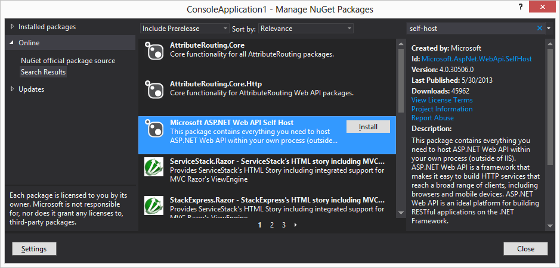
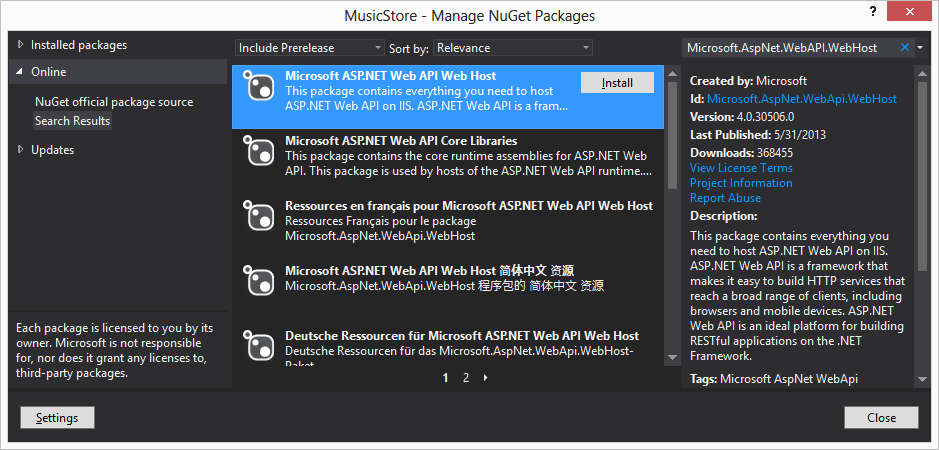

# ASP.NET Web API - Hosting

##**Israel Aece**

Até o momento vimos algumas características do HTTP, a estrutura que uma API deve ter quando utilizamos o ASP.NET Web API, a configuração para rotear as requisições para um tratador (método), etc. Mas para dar vida a tudo isso, precisamos de algum elemento que faça com que toda essa estrutura seja ativada e, consequentemente, passe a tratar as requisições.

O responsável por isso é o hosting. Dado todas as configurações necessárias a ele, ele será responsável por construtir toda a infraestrutura para receber, manipular, processar e devolver a resposta ao cliente.

Nós temos algumas opções para realizar a hospedagem de APIs dentro do .NET, uma cada uma delas possuem suas vantagens e desvantagens. As opções são: self-hosting, web-hosting e cloud-hosting.

A primeira opção, self-hosting, consiste em hospedar as APIs em um processo que não seja o IIS como habitualmente é. Isso permitirá utilizar algum outro processo do Windows, como por exemplo, uma aplicação Console, um Windows Service, ou até mesmo um projeto de testes, que poderemos utilizar para a facilitar a criação de testes unitários.

O primeiro passo para ter acesso a todos os recursos para hospedar APIs escritar em ASP.NET Web API em um processo próprio, é instalar o pacote disponível via Nuget chamado Microsoft ASP.NET Web API Self Host.



Figura 11 - Pacote para self-hosting.

Quando estamos falando em self-hosting, somos obrigados a criar toda a estrutura necessária para hospedar a API, e além disso, precisamos gerenciar a “vida” destes objetos, pois eles não são ativados sob demanda, obrigando eles estarem disponíveis no momento em que a requisição chegar, caso contrário, ela será rejeitada.

Ao referenciar o pacote que vimos acima, o principal assembly que temos é o System.Web.Http.SelfHost .dll. A principal classe a ser utilizada é a HttpSelfHostServer, que em seu construtor recebe a instância da classe HttpSelfHostConfiguration, que tem a função de receber todas as configurações necessárias, para que em tempo de execução, forneça todos os recursos necessários para a API ser executada. 

Antes de qualquer coisa, precisamos criar a classe que representará a API, e isso não muda em nada, independente de como hospedamos a API. Sendo assim, temos que criar uma classe, sufixada com a palavra Controller e herdar da classe abstrata ApiController, e a implementação dos métodos nada muda em relação ao que já conhecemos nos capítulos anteriores.

A partir das APIs criadas, é o momento de fazermos as configurações e, consequentemente, ceder essas informações para que a infraestrutura consiga fazer o papel dela. Como sabemos, as rotas tem um papel extremamente importante para busca pela API, pelo método e mapeamento dos respectivos parâmetros. Todas as configurações, incluindo a tabela de roteamento, está acessível a partida classe HttpSelfHostConfiguration.

Depois das configurações realizadas, passamos a instância desta classe para o construtor da classe HttpSelfHostServer. Internamente esta classe utiliza alguns recursos do framework do WCF para extrair as mensagens do HTTP, materializando em classes para que o ASP.NET Web API possa começar a manipular.

```
C#

static void Main(string[] args)
{
    var config = new HttpSelfHostConfiguration("http://localhost:9393");
    config.Routes.MapHttpRoute("Default", "api/{controller}");

    using (var server = new HttpSelfHostServer(config))
    {
        server.OpenAsync().Wait();
        Console.ReadLine();
    }
}
```

O método OpenAsync, como já suspeita-se, ele tem o sufixo Async por se tratar de um método que é executado de forma assíncrona, retornando um objeto do tipo Task, que representa a inicialização e abertura do serviço, que quando concluída, passará a receber as requisições. O método Wait, exposto através da classe Task, bloqueia a execução até que o host seja aberto.

Um dos overloads do construtor da classe HttpSelfHostServer recebe como parâmetro uma instância da classe HttpMessageHandler, qual podemos utilizar para interceptar a requisição e a resposta, injetando algum código customizado, como por exemplo, efetuar o log das mensagens, inspecionar os headers, etc. No capítulo sobre estensibilidade será abordado as opções disponíveis que temos para isso.

Como vimos, a opção do self-hosting dá a chance de hospedar a API em um projeto que não seja ASP.NET e, consequentemente, não temos a necessidade termos obrigatoriamente o IIS (Internet Information Services), tendo um controle mais refinido sobre a criação e gerenciamento dos componentes da aplicação.

A outra opção que temos para hospedar APIs Web é justamente utilizar o IIS (web-hosting), que por sua vez, nos dá uma infinidade de recursos para gerenciamento das APIs, reciclagem de processo, controle de acesso, ativação, segurança, etc. Esse modelo reutiliza a infraestrutura criada para o ASP.NET e também para o ASP.NET MVC para executar os serviços que serão hospedados ali.

Ao contrário do que vimos na outra opção de hospedagem, quando optamos pelo ASP.NET, é que já temos uma template de projeto disponível chamada Web API (mais detalhes acima), que já traz algumas coisas já pré-configuradas, e os objetos que utilizamos para realizar as configurações e customizações, já estão mais acessíveis. Caso você já esteja utilizando outra template de projeto, podemos recorrer à um outro pacote (via Nuget) chamado Microsoft ASPNET Web API Web Host.



Figura 12 - Pacote para web-hosting.

A configuração já está acessível através do arquivo Global.asax, que nos permite interceptar alguns eventos em nível de aplicação, e um deles é o Application_Start, onde podemos realizar todas as configurações referente ao roteamento para assim possibilitar os clientes chegarem até eles. 

Essa configuração inicial já foi abordada nos capítulos anteriores, mas é claro que o objeto de configuração (tanto no self-hosting quanto no web-hosting) são utilizados apenas para armazenar a tabela de roteamento. Ele vai muito além disso, e vamos explorar mais algumas funcionalidades que ele expõe nos próximos capítulos.

A terceira e última opção abordada aqui é cloud-hosting, onde estaremos utilizando o Windows Azure para publicar e rodar as nossas APIs. Hospedar o serviço na nuvem pode facilitar o escalonamento do mesmo sem que haja a necessidade realizar mudanças na infraestrutura, afinal, o próprio mecanismo de gerenciamento e execução possui algoritmos que detectam o alto volume de acesso e, consequemente, sugerem e/ou ativam novas instâncias (máquinas virtuais) para conseguir atender toda a demanda.

É importante dizer que o hosting nada tem a ver com o meio em que a API ou qualquer tipo de aplicação é distribuída (deployment). A distribuição determina como ela é empacotada, disponibilizada e instalada no computador onde ela será executada. Para cada tipo de hosting que vimos até aqui, há um mecanismo de distribuição diferente, combinando o Visual Studio para a criação do pacote e tecnologias que existem nos computadores e servidores para a instação do mesmo.

[ASP.NET Web API – HTTP, REST e o ASP.NET](https://msdn.microsoft.com/pt-br/library/dn369238.aspx): Para basear todas as funcionalidades expostas pela tecnologia, precisamos ter um conhecimento básico em relação ao que motivou tudo isso, contando um pouco da história e evolução, passando pela estrutura do protocolo HTTP e a relação que tudo isso tem com o ASP.NET.

[ASP.NET Web API – Estrutura da API](https://msdn.microsoft.com/pt-br/library/dn376302.aspx): Entenderemos aqui a template de projeto que o Visual Studio fornece para a construção das APIs, bem como sua estrutura e como ela se relaciona ao protocolo.

[ASP.NET Web API – Roteamento](https://msdn.microsoft.com/pt-br/library/dn376303.aspx): Como o próprio nome diz, o capítulo irá abordar a configuração necessária para que a requisição seja direcionada corretamente para o destino solicitado, preenchendo e validando os parâmetros que são por ele solicitado.

[ASP.NET Web API – Hosting](https://msdn.microsoft.com/pt-br/library/dn376304.aspx): Um capítulo de extrema relevância para a API. É o hosting que dá vida à API, disponibilizando para o consumo por parte dos clientes, e a sua escolha interfere diretamente em escalabilidade, distribuição e gerenciamento. Existem diversas formas de se expor as APIs, e aqui vamos abordar as principais delas.

[ASP.NET Web API – Consumo](https://msdn.microsoft.com/pt-br/library/dn376305.aspx): Como a proposta é ter uma API sendo consumido por qualquer cliente, podem haver os mais diversos meios (bibliotecas) de consumir estas APIs. Este capítulo tem a finalidade de exibir algumas opções que temos para este consumo, incluindo as opções que a Microsoft criou para que seja possível efetuar o consumo por aplicações .NET.

[ASP.NET Web API – Formatadores](https://msdn.microsoft.com/pt-br/library/dn376306.aspx): Os formatadores desempenham um papel importante na API. São eles os responsáveis por avaliar a requisição, extrair o seu conteúdo, e quando a resposta é devolvida ao cliente, ele entra em ação novamente para formatar o conteúdo no formato em que o cliente possa entender. Aqui vamos explorar os formatadores padrões que já estão embuitdos, bem como a criação de um novo.

[ASP.NET Web API – Segurança](https://msdn.microsoft.com/pt-br/library/dn376307.aspx): Como a grande maioria das aplicações, temos também que nos preocupar com a segurança das APIs. E quando falamos de aplicações distribuídas, além da autenticação e autorização, é necessário nos preocuparmos com a segurança das mensagens que são trocadas entre o cliente e o serviço. Este capítulo irá abordar algumas opções que temos disponíveis para tornar as APIs mais seguras.

[ASP.NET Web API – Testes e Tracing](https://msdn.microsoft.com/pt-br/library/dn376309.aspx): Para toda e qualquer aplicação, temos a necessidade de escrever testes para garantir que a mesma se comporte conforme o esperado. Isso não é diferentes com APIs Web. Aqui iremos abordar os recursos, incluindo a própria IDE, para a escrita, gerenciamento e execução dos testes.

[ASP.NET Web API – Estensibilidade e Arquitetura](https://msdn.microsoft.com/pt-br/library/dn376308.aspx): Mesmo que já tenhamos tudo o que precisamos para criar e consumir uma API no ASP.NET Web API, a customização de algum ponto sempre acaba sendo necessária, pois podemos criar mecanismos reutilizáveis, “externalizando-os” do processo de negócio em si. O ASP.NET Web API foi concebido com a estensibilidade em mente, e justamente por isso que existe um capítulo exclusivo para abordar esse assunto.
