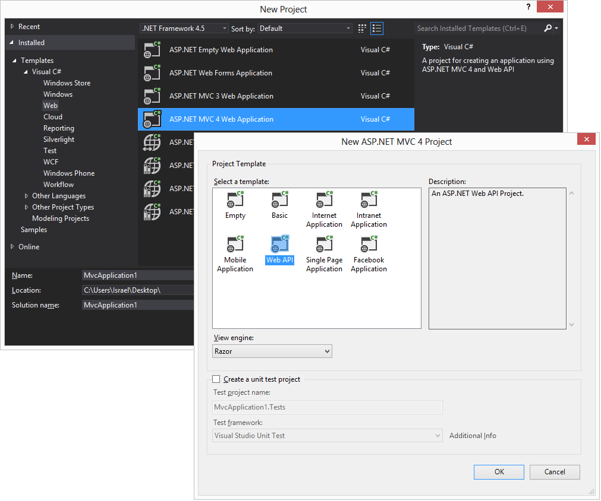
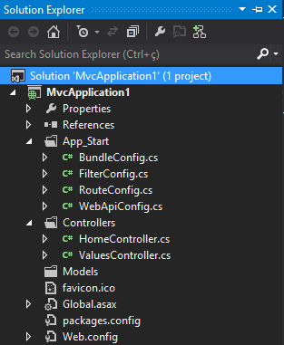
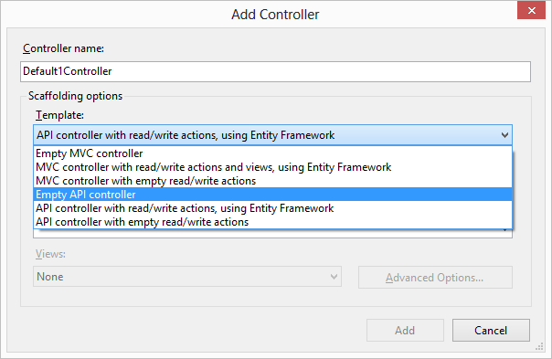

#ASP.NET Web API - Estrutura da API

##**Israel Aece**
Web developer

Apesar de serviços REST utilizar completamente o HTTP, é importante que tenhamos suporte para a construção e consumo destes tipos de serviços. Precisamos entender como estruturar, configurar e distribuir estes tipos de serviços. 

Para facilitar tudo isso, a Microsoft preparou o ASP.NET para suportar o desenvolvimento de serviços REST. A finalidade deste capítulo é introduzir a template de projeto que temos, a API, a configuração mínima para a construção e exposição do mesmo.

##A Template de Projeto

A construção de Web API está debaixo de um projeto ASP.NET MVC 4, e logo na sequência da escolha deste projeto, você deve escolher qual a template de projeto. Neste caso, temos que recorrer a opção chamada Web API, conforme vemos nas imagens abaixo. O projeto já está pré-configurado com o que precisamos para criar um serviço REST e expor para que seja consumido, sem a necessidade de realizar muitas configurações.

Figura 1 - Escolha da Template do Projeto

O projeto já está configurado com as referências (DLLs) necessárias que contém os tipos e membros que utilizaremos na construção das Web APIs, sendo a principal delas o assembly System.Web.Http.dll. Dentro deste assembly temos vários namespaces com todos os elementos necessários que iremos utilizar para a construção de Web APIs. Além disso, já temos algumas configurações definidas para que seja possível criar e executar uma API criada, sem a necessidade de conhecer detalhes mais profundos em um primeiro momento.

Analisando os itens do Solution Explorer, vemos que além dos arquivos tradicionais de um projeto ASP.NET (como o Global.asax e o Web.config), vemos ali um arquivo chamado WebApiConfig.cs, que é uma classe que contém a configuração padrão do roteamento (que será abordado mais adiante) para o funcionamento dos serviços REST. Além disso, temos um serviço já criado como exemplo, que está contido na classe/arquivo ValuesController.cs.

Figura 2 - Elementos Padrão de um Projeto Web API

##A classe ApiController

A construção de Web APIs utilizando o ASP.NET segue uma certa simetria em relação a construção de um site baseado no padrão MVC. Para a construção de views o MVC exige que se tenha um controlador (controller) para receber, processar e retornar as requisições que são realizadas para o site.

De forma parecida trabalha a Web API. Todas as Web APIs construídas no ASP.NET devem herdar de uma classe abstrata chamada ApiController. Esta classe fornece toda a infraestrutura necessária para o desenvolvimento destes tipos de serviços, e entre as suas tarefas, temos: fazer a escolha do método a ser executado, conversão das mensagens em parâmetros, aplicação de eventuais filtros (de vários níveis), etc. Cada requisição, por padrão, terá como alvo um método dentro desta classe, que será responsável por processar a mesma e retornar o resultado. 

A criação de uma Web API pode ser realizada de forma manual herdando da classe ApiController, ou se preferir, pode ser utilizado o assistente que o próprio Visual Studio disponibiliza, onde já existe algumas opções predefinidas para que a classe já seja criada com a estrutura básica para alguns cenários.

Figura 3 -Opções para a criação do Controller

Independentemente da forma que você utilize para a criação do controlador, sempre teremos uma classe que servirá como a base para a API, e o código abaixo ilustra a herança da classe ApiController:

