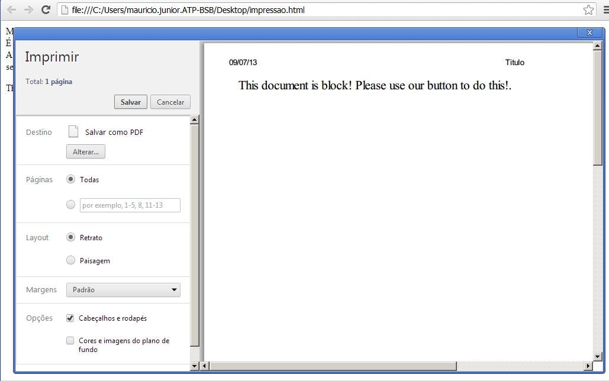
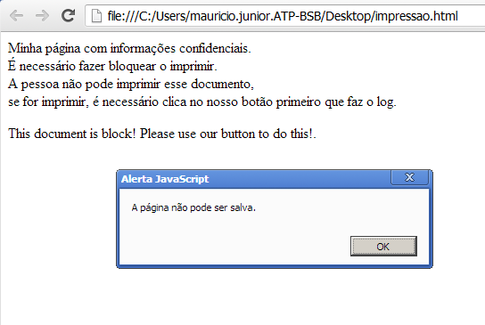

#Web - evitar impressão e botão Ctrl


##**Mauricio Junior**
Outubro, 2013

Olá leitor(a), hoje eu gostaria de mostrar aqui como evitar que o usuário imprima a sua página utilizando o browser e como evitar que o mesmo usuário clique no botão Ctrl para salvar o que tem na sua página.

O grande desafio aqui não é bloquear tudo, é bloquear apenas o necessário. Geralmente o bloqueio é feito em partes do sistema, aquela parte que geralmente alguns perfis tem acesso com usuário e senha. 

Aqui eu mostro como bloquear a impressão de tudo, mesmo utilizando o menu Arquivo >> Imprimir do browser ou clicando no botão de atalho Ctrl + P. Passando para a parte do botão Ctrl, dependendo do seu sistema é melhor adicionar uma página “full screen” ou “popup”, assim o usuário não tem como clicar Ctrl + N ou qualquer outra tecla para salvar a página. Quando o usuário clica no botão Ctrl, aparece pra ele uma mensagem falando que essa tecla está proibida e nada é feito. 

A parte da impressão é feita utilizando CSS, enquanto que a parte do Ctrl é feita com JavaScript na página.

Qual a razão de utilizar essas duas funcionalidades? Bom, a minha razão é porque o cliente solicitou isso no sistema interno dele. Ele quer evitar que os outros usuário possam imprimir a página ou o documento específico. Se você leitor(a) quiser usar só a parte do CSS ou a só a parte do JavaScript, fique a vontade para fazer o que for melhor para você.

Lembro que me baseei pesquisando na Internet e juntando algumas peças necessárias.

#Primeiro passo

O primeiro passo é criar um arquivo chamado print.css, simples e fácil. Esse arquivo pode ser criado usando o notepad do Windows sem qualquer dificuldade. Eu resolvi chamar o arquivo de print.css pelo fato de que o arquivo é focado apenas para imprimir. O code 1.1 mostra o código desenvolvido.

```
CSS

body {
}
#naoimprime 
{
    display: none;
}
#imprime
{
    display:block;
}

```

Code 1.1 – print.css

Esse arquivo .css possui duas tags importantes, uma chamada “naoimprime” e a outra chamada “imprime”. Essas tags precisam ser chamadas de dentro do arquivo .html, .htm, .aspx, .jsf e tudo mais. Lembro que todo esse código funciona em qualquer linguagem e qualquer browser.

Para chamar essas tags do code 1.1, basta colocar o id = “naoimprime” ou id = “imprime”.

#Segundo passo

O segundo passo envolve a criação de uma página em html ou qualquer extensão que está programando, chamando o arquivo .css e definindo o que pode e não pode imprimir. O code 1.2 mostra isso.

```
CSS

<html>
<head>
<title>Titulo</title>
<link rel="stylesheet" type="text/css" href="print.css" media="print" />
</head>
<body>
<div id="naoimprime">
Minha página com informações confidenciais.<br>
É necessário fazer bloquear o imprimir.<br>
A pessoa não pode imprimir esse documento, <br>
se for imprimir, é necessário clica no nosso botão primeiro
que faz o log.
</div>
<div id="imprime">
<p>
This document is block! Please use our button to do this!.
<br>
</p>
</div>
</body>
</html>
```

Code 1.2 - Página HTML.

Na quarta linha do code 1.2 chama o arquivo print.css indicando a propriedade media=”print”. Depois da tag “body” existe a tag div com o id=”naoimprime”. Tudo que estiver dentro dessa div não vai imprimir. É dentro dela que você coloca o conteúdo da sua página ou sistema.

Depois que fechar a tag div, se achar necessário você pode colocar outra tag com o id=”imprime”. Tudo que estiver dentro dessa tag poderá ser impressa sem qualquer problema. Mesmo que usuário clique Ctrl + P ou acesse o endereço Arquivo >> Imprimir, tudo que será impresso é a mensagem falando que o documento está bloqueado. É assim que funciona o bloqueio de impressão sem qualquer problema.

A figura 1 mostra o que acontece se o usuário tentar imprimir.



Figura 1 – Tentando imprimir

#Terceiro passo

O terceiro passo envolve colocar o JavaScript dentro da página para bloquear o botão Ctrl. Se o usuário clicar nesse botão, uma mensagem aparece e não deixa que nada aconteça. Em alguns casos, é melhor usar um “popup” para evitar problemas; isso porque o usuário pode usar o menu do browser.

No geral a parte em JavaScript está pronta e você pode colocar no início da página.

```
JavaScript

<SCRIPT LANGUAGE="JavaScript1.2">
function alerta(){
alert('A página não pode ser salva.');
return false;
}

function verificaBotao(oEvent){
    var oEvent = oEvent ? oEvent : window.event;
    var tecla = (oEvent.keyCode) ? oEvent.keyCode : oEvent.which;
if(tecla == 17 || tecla == 44|| tecla == 106){
alerta();
 }
}
</SCRIPT>

<SCRIPT LANGUAGE="JavaScript1.2">
document.onkeypress = verificaBotao;
document.onkeydown = verificaBotao;
document.oncontextmenu = alerta;
</script>
```

Code 1.3

Note que o code 1.3 possui duas funções específicas. Essa função é colocada dentro da tag head da página html. A primeira função chama “alert”, onde a mensagem é exibida para o usuário. A segunda função chama “verificaBotao” onde recebe um evento. Esse evento detecta o número da tecla apertada e se for 17, 44 ou 106 então a mensagem aparece na tela.

O grande problema do JavaScript é fazer executar mesmo que não tiver dentro de um tempo “input”. Para resolver esse problema, foi atribuído no documento os eventos “onkeypress”, “onkeydown” e “oncontextmenu”, responsáveis pelo clique em qualquer parte da página. Isso faz com que, mesmo que a página não tenha nenhum campo “input”, se for colocado a tecla a mensagem aparece.

Para finalizar, o code 1.4 mostra toda página.

```
JavaScript

<html>
<head>
<title>Titulo</title>
<link rel="stylesheet" type="text/css" href="print.css" media="print" />
<SCRIPT LANGUAGE="JavaScript1.2">
function alerta(){
alert('A página não pode ser salva.');
return false;
}

function verificaBotao(oEvent){
    var oEvent = oEvent ? oEvent : window.event;
    var tecla = (oEvent.keyCode) ? oEvent.keyCode : oEvent.which;
if(tecla == 17 || tecla == 44|| tecla == 106){
alerta();
 }
}
</SCRIPT>

<SCRIPT LANGUAGE="JavaScript1.2">
document.onkeypress = verificaBotao;
document.onkeydown = verificaBotao;
document.oncontextmenu = alerta;
</script>
</head>

<body>
<div id="naoimprime">
Minha página com informações confidenciais.<br>
É necessário fazer bloquear o imprimir.<br>
A pessoa não pode imprimir esse documento, <br>
se for imprimir, é necessário clica no nosso botão primeiro
que faz o log.
</div>

<div id="imprime">
<p>
This document is block! Please use our button to do this!.
<br>

</p>
</div>
</body>
</html>
```

Code 1.4 – Toda a página

A figura 2 mostra a mensagem na tela do usuário.



Figura 2 – Mensagem na tela. 

Bom, eu fico por aqui e qualquer dúvida pode entrar em contato pelo site www.mauriciojunior.org. Abraços e espero que tenha gostado.
