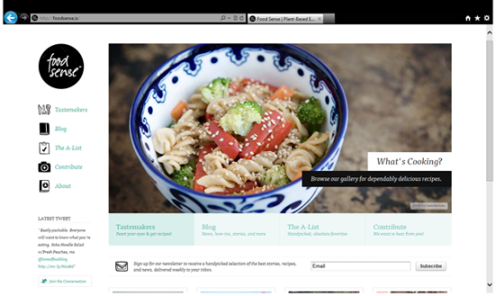
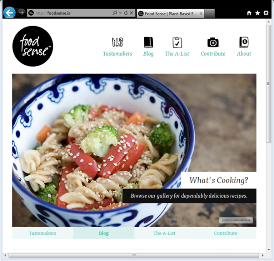
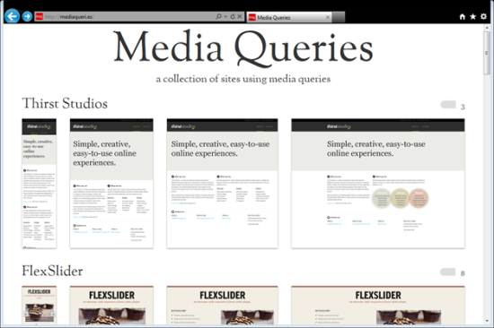
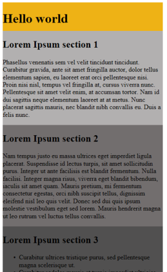
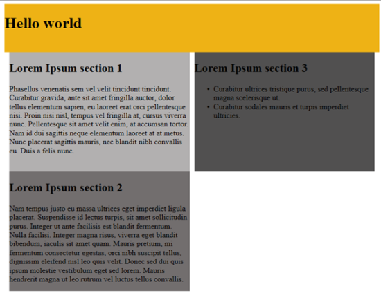
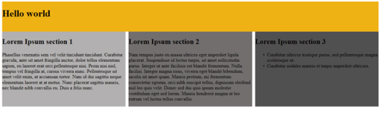

#Design da Web responsivo

##**Ethan Marcotte**
Web developer

Tudo começou com Design da Web responsivo, um artigo de Ethan Marcotte em A List Apart. Essencialmente, o artigo propunha lidar com o panorama de dispositivos, navegadores, tamanhos e orientações de tela em constante mudança através da criação de sites flexíveis, fluidos e adaptáveis. Em vez de responder às necessidades de hoje de uma versão Web adaptada de desktop, junto com uma determinada versão móvel (frequentemente específica de um único dispositivo móvel), a ideia é abordar a questão ao contrário: usar layouts flexíveis e fluidos para se adaptarem a quase qualquer tela.

**Conceitos básicos**

Três recursos técnicos principais são a alma do design de Web responsivo:

* Consultas de mídia e ouvintes de consultas de mídia
* Um layout flexível baseado em grade que usa dimensionamento relativo
* Imagens e mídia flexíveis, através do redimensionamento dinâmico ou CSS

O design de Web verdadeiramente responsivo exige que os três recursos sejam implantados

O ponto principal é a adaptação às necessidades do usuário e às capacidades do dispositivo. Imagine que um usuário móvel verá o seu site em uma tela pequena. Levar as necessidades do usuário em consideração não significa apenas adaptar seu conteúdo ao tamanho da tela. Significa também pensar no que aquele usuário móvel precisará primeiro quando visitar seu site e então elaborar o conteúdo de acordo. Talvez você apresente as informações em uma ordem diferente. Não presuma que o usuário não precisará de acesso a todas as informações do site só porque está em um dispositivo móvel. Você pode precisar mudar as fontes ou as áreas de interação para responder melhor a um ambiente de toque. Todos esses fatores influenciam o design de Web responsivo.

Embora os dispositivos móveis estejam mudando o panorama das telas, com o aparecimento crescente de mais e mais telas pequenas, não se esqueça do que está acontecendo do outro lado do espectro. Telas também estão se tornando cada vez maiores. Precisar atender aos dois segmentos não deveria impedir designers de serem inovadores em nenhum deles. 

Consultas de mídia

Começando com CSS 2.1, tipos de mídia eram usados para aplicara CSS tanto para tela como para impressão. Você deve se lembrar destes tipos de mídia:

```CSS
<link rel="stylesheet" type="text/css" href="style.css" media="screen" />'
<link rel="stylesheet" type="text/css" href="printfriendly.css" media="print" />
```
Era assim! Felizmente, o W3C melhorou [consultas de mídia](http://www.w3.org/TR/css3-mediaqueries/) no CSS3, levando-as um passo adiante.

Hoje, você pode usar consultas de mídia para definir estilos para capacidades específicas, aplicando diferentes estilos com base nas capacidades que correspondam à sua consulta. Pode até combinar consultas e testar diversos recursos usando operadores semânticos (como AND e NOT). Recursos incluem largura, altura, largura máxima, altura máxima, altura do dispositivo, orientação, taxa de proporção, resolução e outros.

Há três maneiras de se implementar consultas de mídia:

1.Usar a regra @import para importar regras de estilo de outras folhas de estilo:
2.@import url(style600min.css) screen and (min-width: 600px);
3.Colocar consultas de mídia diretamente na folha de estilos, como mostrado na exemplo. Esta é a abordagem mais comum.

Exemplo - Implementação de consultas de mídia diretamente em uma folha de estilos.

```
#nav
    {
        float: right;
    }
        #nav ul
        {
            list-style: none;
        }
    @media screen and (min-width: 400px) and (orientation: portrait)
        {
                #nav li
                {
                    float: right;
                    margin: 0 0 0 .5em;
                    border:1px solid #000000;
                }
        }
    @media screen and (min-width: 800px)
        {
            #nav
            {
                width: 200px;
            }
               #nav li
                {
                    float: left;
                    margin: 0 0 0 .5em;
                    border: none;               
                }
        }
```
Incluir uma consulta em um atributo de mídia de folha de estilos vinculado.

```
<link rel="stylesheet" type="text/css" media="screen and (max-device-width: 800px)" href="style800.css" />
```
Por causa da natureza (em cascata da CSS, estilos padrão são definidos no alto com as regras e estilos correspondentes da consulta de mídia abaixo). Estilos definidos no alto serão lançados em cascata para os estilos correspondentes na regra, ou até mesmo totalmente sobrescritos.

As imagens a seguir apresentam um exemplo de uma abordagem de design de Web responsivo que usa consultas de mídia. A Figura 1 e a Figura 2 mostram uma área de trabalho usando o Internet Explorer 9 em duas resoluções diferentes. A Figura 3 mostra o mesmo site responsivo em um Windows Phone, também com o Internet Explorer 9.



Figura 1 - A navegação aparece à esquerda.



Figura 2 - Em uma janela redimensionada para 800x600, a navegação passa para o topo.


Figura 3 - O mesmo site em um Windows Phone

Se estiver procurando alguns exemplos ótimos de design de Web responsivo que tiram proveito total de consultas de mídia, o site de entusiastas (http://mediaqueri.es/) pode ser viciante, como mostra a Figura 4.




Figura 4 - Um conjunto de sites que usam consultas de mídia

#Ouvintes de consultas de mídia

Levando as consultas de mídia um passo adiante, o grupo de trabalho CSS Object Model (CSSOM) do W3C também criou ouvintes de consultas de mídia, que fornecem uma API para responder a mudanças nas consultas de mídia. Em vez de ter de pesquisar mudanças ou carregar várias versões de um recurso, você pode usar a API, por exemplo, para baixar imagens apenas de um determinado tamanho quando uma correspondência de consulta de mídia é disparada.

Hoje, o Firefox e o the [Internet Explorer 10 Platform Preview](https://msdn.microsoft.com/library/hh673538.aspx#_DOMMediaQuery) implementam ouvintes de consultas de mídia; você pode ver a demonstração “Consultas de mídia CSS3 e Ouvintes de consultas de mídia” no test-drive do IE.

#Uma palavra sobre o Viewport

Quando testa consultas de mídia em navegadores móveis, você pode notar que as consultas corretas não estão sendo realmente aplicadas. Quando isso acontece, o navegador móvel está fazendo um trabalho em seu nome para renderizar a página de forma ideal na tela menor.

Então você acha que não há uma forma de se obter a resolução real? Na verdade, há, na metatag viewport. A metatag viewport controla as dimensões lógicas e o dimensionamento da janela do navegador móvel (Chromeless). Definir width como device-width contorna o problema:

```
<meta name="viewport" content="width=device-width">
```
Outras configurações de viewport incluem maximum-zoom e initial-scale.

#Grades flexíveis

Um layout baseado em grade flexível é uma das pedras angulares do design responsivo. O termo "grade" é usado com bastante liberdade e não implica em um requisito de se implementar qualquer das estruturas de grade disponíveis. O que isso significa aqui é usar a CSS para posicionar e definir margens e espaçamento e para implementar vários [tipos de layout da Web](http://sixrevisions.com/web_design/a-guide-on-layout-types-in-web-design/) de uma forma nova. Layouts e tamanhos de texto são tipicamente expressos em pixels. Designers adoram pixels. O Photoshop adora pixels. Mas um pixel pode ser um ponto em um dispositivo e oito pontos em outro. Então como se aborda o design de Web responsivo se tudo se baseia em pixels? Você pode não gostar da resposta. Você para de usar layouts baseados em pixels e começa a usar porcentagens ou o em para dimensionamento.

Baseando os tamanhos de texto, larguras e margens em porcentagens ou no em, uma unidade de medida baseada no tamanho do ponto de uma fonte, você pode transformar um tamanho fixo em tamanho relativo. Isso significa que você precisará fazer alguns pequenas contas para obter um sistema de grade e de tamanho de texto flexíveis. Mas a fórmula para calcular o em é bem simples:

destino ÷ contexto = resultado

Digamos que o contexto normal para o tamanho da fonte do corpo seja de 16 pixels. Se o designer especificar que a H1 deve ser de 24 pixels, você pode calcular o seguinte:

24 ÷ 16 = 1.5

Isso resulta no estilo de CSS a seguir:

```
h1
{
        font-size: 1.5em;
}
```

Sempre leve o contexto em consideração. Continuando com o exemplo anterior, se você tiver um elemento dentro da H1 que precise ter 12 pixels, usa a H1 atual como o contexto. O contexto agora é 24 pixels, assim, o cálculo de contexto para H1 a" é:

12 ÷ 24 = 0.5

E o estilo da CSS é:

```
h1 a
{
        font-size: 0.5em;
}
```

Você também pode usar porcentagens. O algoritmo de cálculo é o mesmo; você apenas acaba com porcentagens.

Grades flexíveis usam essa abordagem. Você pode encontrar várias estruturas para ajudá-lo a criar sua grade, como o [Fluid Grid System](http://ww7.newgoldleaf.com/) ou o [Fluid 960 Grid System](http://www.designinfluences.com/fluid960gs/) (uma versão fluida do 960 Grid System). Além disso, vários grupos dentro do W3C enviaram especificações novas para grades flexíveis melhores, com alguns resultados úteis.

#CSS3 Grid Layout

O [CSS3 Grid Layout](https://drafts.csswg.org/css-grid-1/) (também conhecido como Alinhamento de grade, simplesmente, Grade), traz um sistema de grade típico à CSS, similar ao que desenvolvedores em XAML ou Silverlight podem estar familiarizados. Na ocasião deste artigo, a especialização é um "rascunho de editor”. Ela permite definir regiões em um layout, com colunas e linhas, distâncias, espaçamentos, preenchimentos, modelos de grade e mais, impondo separação completa de preocupações entre elementos HTML e CSS. Diferentemente de tabelas HTML que são conteúdo, a Grade permite a disposição de primitivos HTML em regiões de grade separadas do conteúdo em si.

Combinar o CSS3 Grid com consultas de mídia cria uma solução poderosa para se construírem aplicativos fluidos e responsivos.

Como a Grade funciona? Você começa definindo o bloco de exibição em ‘grid’. (Você precisa usar prefixos de fornecedor de CSS, pois essa ainda não é uma recomendação de CSS3. Neste momento, apenas o Internet Explorer 10 Platform Preview suporta a especificação, então você verá o prefixo do fornecedor de CSS -ms- usado aqui.) Vejamos três exemplos de como você pode definir diferentes modos de exibição dependendo do tamanho da tela. Consultas de mídia são usadas para se aplicarem diferentes estilos de grade dependendo da largura da tela.

No primeiro exemplo, o HTML para definir o contexto consiste em um cabeçalho e três diferentes blocos de texto (veja a exemplo).

Exemplo - Definição de conteúdo para a Grade

```
HTML
<div id="mygrid">
        <header id="myheader">
                <h1>Hello world</h1>
        </header>
        <div id="block1">
                <h2>Lorem Ipsum section 1</h2>
                <p>
                      Phasellus venenatis sem vel velit tincidunt tincidunt.
                        Curabitur gravida, ante sit amet [... ...]
                </p>
        </div>
        <div id="block2">
                <h2>Lorem Ipsum section 2</h2>
                <p>
                Nam tempus justo eu massa ultrices eget imperdiet ligula placerat.
                Suspendisse [... ...].
                </p>
        </div>
                <div id="block3">
                <h2>Lorem Ipsum section 3</h2>
                <ul>
                      <li>Curabitur ultrices tristique purus, sed pellentesque
                            magna scelerisque ut.</li>
                        <li>[... ...] </li>
                </ul>
        </div>
</div>
```

Você começa dispondo os blocos de conteúdo debaixo uns dos outros para que o conteúdo se ajuste a smartphones (veja a Exemplo). Você podem acrescentar cores de fundo como mostrado na Figura 7 para tornar mais claro que está trabalhando com itens de grade.

Exemplo - Disposição de blocos de conteúdo

```
Bloco 1
@media only screen and (max-width : 480px) {
    #mygrid {
        display: -ms-grid;
        margin: 3px;
        -ms-grid-columns: 100%; /*one column taking full width */
        -ms-grid-rows: 70px auto auto auto; /*4 rows */
    }
    #myheader {
            -ms-grid-row: 1;
            -ms-grid-column: 1;
    }
    #block1 {
            -ms-grid-row: 2; /*place into row 2 / column 1*/
            -ms-grid-column: 1;
    }
    #block2 {
            -ms-grid-row: 3;
            -ms-grid-column: 1;
    }
    #block3 {
            -ms-grid-row: 4;
            -ms-grid-column: 1;
    }
}
```



Figura 7 - Blocos de conteúdo com cores de fundo

No segundo exemplo, uma consulta de mídia aplica estilos definidos para tamanhos de tela superiores a 481 pixels—qualquer coisa mais larga que um smartphone típico. Você pode usar a Grade para definir duas colunas e mover os blocos para posições desejadas (veja a Exemplo). O resultado é mostrado na Figura 9.

Exemplo - Definição de um novo layout para uma tela maior

```
Bloco2
@media only screen and (min-width : 481px) {
/*make two columns and move block 3 next to 1 — just because we can*/
    #mygrid {
        display: -ms-grid;
        -ms-grid-columns: 10px 1fr 10px 1fr 10px; /*10px columns to spacing in between*/
        -ms-grid-rows: 100px 1fr 1fr; /*100px row and two rows each taking 1 fraction
                                          of available space*/
        margin: 5px;
    }
    #myheader {
            -ms-grid-row: 1;
            -ms-grid-column: 1;
            -ms-grid-column-span: 5;
            background-color: #EEB215;
    }
    #block1 {
            -ms-grid-row: 2;
            -ms-grid-column: 2;
            background-color: #B2B0B0;
    }
    #block2 {
       -ms-grid-row: 3;
       -ms-grid-column: 2;
       background-color: #726E6E;
    }
    #block3 {
       -ms-grid-row: 2; /*block 3 can go into row 2*/
       -ms-grid-column: 4;
       background-color: #515050;
    }
}
```



Figura 9 - Um novo layout com duas colunas adjacentes

A terceira amostra de grade exibe a tela em larguras maiores que 1220 pixels. Você define uma grade com um cabeçalho mais largo que engloba várias colunas e depois define três delas, cada qual ocupando uma fração do espaço disponível, com algumas colunas de 10 pixels entre elas (veja a Exemplo). O resultado é mostrado na Figura 11.

Exemplo - Definição de um layout para telas mais largas

```
Bloco3
@media only screen and (min-width: 1220px) {
    #mygrid {
        display: -ms-grid;
        -ms-grid-columns: 1fr 10px 1fr 10px 1fr;
        -ms-grid-rows: 100px 1fr;
        margin: 5px;
    }
    #myheader {
            -ms-grid-row: 1;
            -ms-grid-column: 1;
            -ms-grid-column-span: 5;
            background-color: #EEB215;
    }
    #block1 {
            -ms-grid-row: 2;
            -ms-grid-column: 1;
            background-color: #B2B0B0;
    }
    #block2 {
            -ms-grid-row: 2;
            -ms-grid-column: 3;
            background-color: #726E6E;
            }
    #block3 {
            -ms-grid-row: 2;
            -ms-grid-column: 5;
            background-color: #515050;
    }
}
```



Figura 11 - Três colunas lado a lado com um cabeçalho abrangente

A especificação Grade é um acréscimo bem-vindo à implementação de designs de Web responsivos.

Duas outras especificações de CSS também são dignas de nota: o [Flexible Box Layout Module](http://www.w3.org/TR/2009/WD-css3-flexbox-20090723/) (Flexbox) e o [Multi-column Layout Module](http://www.w3.org/TR/css3-multicol/). Ambos representam grandes promessas para o design de sites responsivos.

O Flexbox, atualmente um rascunho de trabalho no W3C, acrescenta suporte a quatro novos modos de layout: em bloco, alinhado, tabela e posicionado. Ele permite que você esquematize páginas complexas com posição relativa e tamanho constante, mesmo quando o tamanho da tela muda.

O módulo de layout multicoluna é atualmente uma recomendação candidata no W3C. Essa solução se destina a conteúdo que você precisa dispor em colunas e que fluem de uma coluna para a seguinte. Você pode ver um exemplo interativo do layout multicoluna neste laboratório.

Imagens e mídia flexíveis

O aspecto final do design de Web responsivo são imagens e mídia flexíveis. Basicamente, esse recurso permite que você adapte suas imagens ou outras mídias para carregarem-se de forma diferente dependendo do dispositivo, através de dimensionamento ou usando a propriedade de estouro de CSS

O dimensionamento em CSS é simples de implementar tanto para imagens como para vídeo. Você pode definir max-width do elemento de mídia como 100 por cento, e o navegador fará a imagem encolher ou expandir-se dependendo de seu contêiner. Você deve fornecer a imagem na melhor qualidade e tamanho possíveis e deixar a CSS adaptar a imagem para o tamanho correto.


```
CSS
img, object 
{
     max-width: 100%;
}
```

Uma alternativa para o dimensionamento de imagens é recortá-las com CSS. Por exemplo, aplicar overflow:hidden permite que se recortem imagens dinamicamente para que elas se ajustem à medida que os contêineres se redimensionam para se adaptarem a um novo ambiente de tela.

Várias opções para dimensionar e recortar imagens em CSS pode não ser o bastante. Você precisa mesmo ocupar toda a largura de banda móvel de um visitante porque não tem uma versão menor de uma imagem? Para atender melhor aos usuários, imagens flexíveis podem significar uma imagem alternativa—ou até mesmo nenhuma imagem. Pessoas da comunidade de design de Web estão propondo [soluções](https://www.filamentgroup.com/lab/responsive-images-experimenting-with-context-aware-image-sizing.html) baseadas em JavaScript e cookies, e pode-se esperar mais disso conforme o design de Web responsivo evolui e se torna a base para muitos sites de qualidade.

#Navegadores legados

E quanto a navegadores antigos que não suportam consultas de mídia? E quanto ao Internet Explorer antes da versão 8, que tem problemas com o dimensionamento de imagens? Soluções na forma de polyfills podem ajudar. Aqui estão alguns exemplos úteis.
* css3-mediaqueries.js de Wouter van der Graaf: code.google.com/p/css3-mediaqueries-js/
* Response.js: github.com/scottjehl/Respond
* Imagens fluidas. unstoppablerobotninja.com/entry/fluid-images/

#Conclusão

Entrar na onda do design de Web responsivo é algo para ser levado a sério. Considere o que você precisa conseguir e se atender a uma versão específica de um dispositivo desktop ou móvel específico é o ideal.

O design de Web responsivo está em suas fases iniciais. Designers de Web continuarão a oferecer opiniões diferentes e recomendarão rumos relacionados a se criar primeiro para dispositivos móveis, como ajustar essas decisões no processo de design, dividir os computadores em todos os diferentes tamanhos de tela e assim por diante. E, à medida que mais e mais tamanhos de tela e fatores forma surgirem, a discussão continuará.

Os padrões de HTML e de CSS estão evoluindo para ajudar designers de Web a lidarem com essas questões Está claro que alguma forma de design de Web responsivo será usado para se enfrentarem os desafios, e igualmente claro que padrões continuarão a evoluir conforme maneiras melhores de se lidar com o mundo dos dispositivos e navegadores, em eterna mudança, são descobertas.

Aqui estão alguns recursos adicionais:

* [Design de Web responsivo](http://alistapart.com/article/responsive-web-design)
* [Técnicas, ferramentas e estratégias de design de Web responsivo](https://www.smashingmagazine.com/2011/07/responsive-web-design-techniques-tools-and-design-strategies/)
* [Consultas de mídia de CSS3 rígidas](https://stuffandnonsense.co.uk/projects/320andup/)
* [Golden Grid System]9http://goldengridsystem.com/)
* [Uma olhada breve em layouts baseados em grade em design de Web](https://msdn.microsoft.com/pt-br/library/dn163510)


